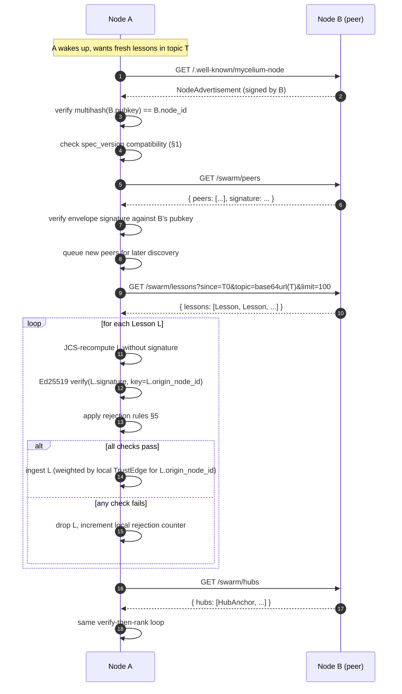

# SWARM_SPEC — wire-format spec for the decentralized mycelium swarm

**Spec version:** `1.0`
**Status:** spec-only (no code lands against this PR; phases 1–9 of the
Swarm Foundation Plan implement against this contract).
**Audience:** anyone implementing a mycelium node — this repo, a port to
another language, or an independent peer that wants to be reachable by the
swarm.

---

## 0. Three unverletzliche Designprinzipien

These three principles are non-negotiable. Any change to this spec, or any
implementation of it, that weakens one of them is invalid and must be
rejected before merge.

1. **Souveränität.** Every node is owned and operated by its user.
   The swarm has no central authority. A node can be disconnected from the
   swarm at any moment and continue to function as a complete cognitive
   substrate. Federation is opt-in; offline is the default-correct state.

2. **Generalisierung-vor-Sharing.** Raw episodic memory never leaves the
   node. Only knowledge that has already been generalized inside the
   originating node — synthesized lessons, hub-anchor embeddings,
   signed metadata — is eligible for the wire. The producing node decides
   what is general enough to share; consumers cannot pull raw episodes.

3. **Diversität.** The swarm's value is the spread of lived experience
   across nodes, not the average. Sync protocols, trust functions, and any
   future ranking machinery must preserve heterogeneity. Convergence
   pressure (e.g. "everyone keeps the most-popular lesson") is an
   anti-goal.

These mirror the project's [`CONSTITUTION.md`](../CONSTITUTION.md) and the
*Schwarm-These* memory (`3acb8bb1-f374-436c-a3db-df2af9e50a83`).

---

## 1. Spec versioning

- The current spec version is the string `"1.0"`.
- Every signed wire record and every `NodeAdvertisement` MUST carry a
  `spec_version` field.
- Version negotiation between two nodes is **strict equality on the
  major component** for v1: a node implementing `"1.x"` MUST refuse to
  consume records whose `spec_version` major differs from its own. Minor
  bumps are reserved for backward-compatible additions (new optional
  fields, new endpoints, new rejection rules); a v1.1 node MUST still
  accept v1.0 records.
- The string format is `"<major>.<minor>"`, both decimal integers,
  no leading zeros, no whitespace. Future pre-release suffixes are out
  of scope for v1.
- Spec amendments are made by PR against this file; bumping `spec_version`
  is the same kind of change as a Constitution amendment in spirit and
  must explicitly justify why it does not weaken the three Designprinzipien
  above.

---

## 2. JSON Canonical Form

All signatures in this spec are computed over the **JSON Canonicalization
Scheme (JCS), [RFC 8785](https://www.rfc-editor.org/rfc/rfc8785)**,
applied to the record with the `signature` field omitted.

JCS gives us a single deterministic byte sequence for any given JSON
value. The relevant rules, restated for implementer convenience:

- Object keys are sorted by **UTF-16 code unit** order (not Unicode code
  point, not byte order).
- Whitespace is removed; the encoding is the minimal compact form.
- Strings use UTF-8 with the JSON-mandated escapes; no extra escapes.
- Numbers are serialized using the **ECMAScript `Number.prototype.toString`**
  algorithm as required by JCS.
- The input is constrained to **I-JSON** (no duplicate keys, no NaN, no
  Infinity, no `-0` distinct from `0`).

### 2.1 Float embeddings under JCS — implementer warning

Embeddings are arrays of 768 IEEE-754 double-precision floats. JCS
serializes each via ECMAScript's number-to-string algorithm, which is
**not** the same as a language's default `printf("%g")` or
`json.dumps(float)`. Two implementations that round embeddings differently
before signing will produce different signatures over byte-identical
vectors.

Rules for v1:

- The producer MUST serialize each embedding component using a JCS-conformant
  number serializer. Reference implementations exist in JS
  ([`json-canonicalize`](https://www.npmjs.com/package/json-canonicalize)),
  Rust ([`serde_json_canonicalizer`](https://docs.rs/serde_json_canonicalizer/)),
  and others.
- Embeddings MUST be transmitted as full-precision floats (no pre-truncation
  to N decimal places). Truncating before signing is allowed, but the
  truncated value is then the signed value — receivers cannot distinguish.
- The producer MUST sign the canonical bytes, not the in-memory value.
- A receiver computes the canonical bytes from the received JSON, verifies
  the signature against those bytes, and only then trusts the parsed value.

### 2.2 Signing inputs

For a signed record `R`:

1. Take the JSON object `R'` = `R` with the `signature` key removed.
2. Compute `bytes = JCS(R')`.
3. `signature = base64(Ed25519_sign(node_private_key, bytes))`.
4. Re-attach `signature` to `R` for transport.

Verification is the inverse: strip `signature`, JCS the remainder, verify
against the producer node's published public key.

### 2.3 Signature algorithm

- v1 uses **Ed25519** exclusively (RFC 8032).
- Public keys are 32 raw bytes, transported as unpadded base64url in
  `pubkey` fields, padded base64 in `signature` fields. (The asymmetry is
  inherited from common library defaults; both encodings are valid base64
  variants and both are stable across implementations.)
- Key rotation is **out of scope for v1** (see §6).

---

## 3. Wire types

All wire types are JSON objects. Field types use the following shorthand:

| shorthand | meaning |
|---|---|
| `string` | UTF-8 string, no NUL bytes |
| `uuid` | RFC 4122 v4 UUID, lowercase, hyphenated, 36 chars |
| `iso8601` | RFC 3339 date-time, UTC (`Z` suffix), millisecond precision: `2026-04-27T18:31:33.183Z` |
| `int` | JSON number, integer, fits in int64, ≥ 0 unless noted |
| `float` | JSON number, IEEE-754 double, finite (no NaN/Inf) |
| `float[N]` | JSON array of exactly N `float` |
| `string[]` | JSON array of `string`, may be empty |
| `base64` | standard base64 with padding (RFC 4648 §4) |
| `base64url` | URL-safe base64 without padding (RFC 4648 §5) |
| `multihash` | self-describing hash per the multihash spec, base58btc-encoded; see §3.5 |
| `https-url` | absolute URL, scheme MUST be `https`, no fragment, no userinfo |

All timestamps in wire records are UTC. Local-zone timestamps are a v1
hard error (§5).

### 3.1 `Lesson`

A generalized piece of knowledge that the producing node has decided is
shareable. Lessons are the primary unit of swarm sync.

| field | type | required | meaning |
|---|---|---|---|
| `id` | `uuid` | yes | Lesson identity. Stable across re-publishes. |
| `content` | `string` | yes | The lesson text, in the producer's voice. ≤ 8 KiB UTF-8. |
| `embedding` | `float[768]` | yes | Embedding of `content` from the producer's local model (see §3.6). |
| `synthesized_from_cluster_size` | `int` | yes | Number of source episodes the producer condensed to make this lesson. ≥ 1. Provenance signal — receivers may weight by it. |
| `origin_node_id` | `string` (multihash) | yes | The producing node's `node_id` (§3.5). |
| `signed_at` | `iso8601` | yes | When the producer signed this record. |
| `signature` | `base64` | yes | Ed25519 signature over JCS(record − signature) using `origin_node_id`'s key. |
| `created_at` | `iso8601` | yes | When the lesson was first synthesized locally. May be earlier than `signed_at`. |
| `tags` | `string[]` | no | Free-form classification hints. Producers SHOULD keep ≤ 16 tags, each ≤ 64 chars. |
| `spec_version` | `string` | yes | Spec version this record conforms to (§1). |

**Generalization rule.** A `Lesson` MUST NOT be a verbatim copy of a single
episode. Producers MUST satisfy `synthesized_from_cluster_size ≥ 2` OR
have a documented synthesis step that demonstrably abstracts (e.g. a REM
synthesizer call). This is the on-wire enforcement of Designprinzip 2.

### 3.2 `HubAnchor`

A signed pointer to a region of embedding-space where the producing node
has high local activity ("a hub I have a lot to say about"). Used by
peers to discover whose lessons are likely to cover a given topic.

| field | type | required | meaning |
|---|---|---|---|
| `embedding` | `float[768]` | yes | Centroid of the hub region, in the producer's embedding space. |
| `hub_score` | `float` | yes | 0..1, the producer's internal centrality measure for this hub. Comparison across nodes is not guaranteed (§3.6). |
| `local_memory_count` | `int` | yes | Number of local memories aggregated into this anchor. ≥ 1. |
| `topic_label` | `string` | no | Short human-readable label, ≤ 256 chars. Hint only — not a key. |
| `origin_node_id` | `string` (multihash) | yes | Producing node. |
| `signed_at` | `iso8601` | yes | Signing time. |
| `signature` | `base64` | yes | Ed25519 over JCS(record − signature). |
| `spec_version` | `string` | yes | Spec version. |

`HubAnchor` does not carry any episode content — only the centroid and
counts. It is a pointer, not data.

### 3.3 `NodeAdvertisement`

A node's self-description, served at `/.well-known/mycelium-node` (§4) and
relayed via `/swarm/peers`.

| field | type | required | meaning |
|---|---|---|---|
| `node_id` | `string` (multihash) | yes | The node's identity. MUST equal `multihash(pubkey)` (§3.5). |
| `pubkey` | `base64url` | yes | Ed25519 public key, 32 raw bytes, unpadded base64url. |
| `display_name` | `string` | no | Human-friendly label, ≤ 64 chars. |
| `endpoint_url` | `https-url` | yes | Base URL where this node's swarm endpoints (§4) are served. |
| `spec_version` | `string` | yes | Highest spec version the node implements. |
| `signed_at` | `iso8601` | yes | Signing time. |
| `signature` | `base64` | yes | Ed25519 over JCS(record − signature). |

Self-signing is required: the advertisement is signed by the same key it
declares. Verification therefore needs no out-of-band trust root.

### 3.4 `TrustEdge` (local-only)

Trust is **local state**, never shared on the wire. It is specified here
so all implementations agree on its shape.

| field | type | required | meaning |
|---|---|---|---|
| `truster_node_id` | `string` (multihash) | yes | The node whose opinion this is (= the local node). |
| `trustee_node_id` | `string` (multihash) | yes | The node being rated. |
| `weight` | `float` | yes | 0..1. 0 = ignore everything from `trustee`, 1 = full weight. |
| `reason` | `string` | yes | Free-form, ≤ 512 chars. Auditable note for the user. |
| `updated_at` | `iso8601` | yes | Last change. |

A node MAY expose its trust list to its operator (the user who owns the
node) but MUST NOT expose it across the wire. There is intentionally no
HTTP endpoint that returns `TrustEdge` records (§4).

### 3.5 `node_id` — multihash of the public key

`node_id` is a self-certifying identifier:

```
node_id = base58btc( multihash( sha2-256, pubkey_raw_bytes ) )
```

per the [multihash](https://multiformats.io/multihash/) spec, function
code `0x12` (sha2-256), digest length 32. This makes a node's address
verifiable without consulting any registry: you can hash the `pubkey`
field of a `NodeAdvertisement` and check it matches `node_id`.

### 3.6 Embedding model

v1 fixes the embedding to **768-dimensional `nomic-embed-text`** vectors
(matching the local Ollama model already used by mycelium). All wire
records carrying an `embedding` field MUST use this model.

This is a hard constraint, not a hint: cross-model embeddings are
geometrically incomparable and would silently degrade `HubAnchor`
matching. Mixing models is out of scope for v1; v2 will define a
`embedding_model_id` field and per-model index segregation.

---

## 4. Endpoints

All endpoints are HTTP/1.1 or HTTP/2 over TLS (`https://`). No WebSocket,
no long-poll, no server push in v1. All response bodies are
`application/json; charset=utf-8`.

### 4.1 `GET /.well-known/mycelium-node`

Returns this node's `NodeAdvertisement`.

- **200**: body is a single `NodeAdvertisement` object.
- This endpoint is **unauthenticated** and **idempotent**. Every node
  exposes it. Discovery starts here.

### 4.2 `GET /swarm/peers`

Returns peers this node has chosen to relay. The list is the responding
node's curated view, not a global directory.

- **200**: body is `{ "peers": NodeAdvertisement[], "signed_at": iso8601, "signature": base64, "origin_node_id": string }`.
- The wrapping envelope itself is signed by the responding node so the
  receiver can attribute the curation choice.
- A node SHOULD NOT include peers it does not currently trust (`TrustEdge.weight = 0`).
- Pagination is out of scope for v1; if the list grows past one response,
  a v1 node MAY truncate and the receiver MUST tolerate truncation.

### 4.3 `GET /swarm/lessons`

Returns signed `Lesson` records.

Query parameters:

| name | required | type | meaning |
|---|---|---|---|
| `since` | no | `iso8601` | Only lessons with `signed_at > since`. Default: epoch. |
| `topic` | no | `base64url` of `float[768]` packed as little-endian float64 | Only lessons whose `embedding` cosine-distance to `topic` is below the responder's local threshold. Encoding: 768 × 8 = 6144 bytes → 8192 base64url chars. |
| `limit` | no | `int` | Max lessons. Default 100. Hard cap 1000. |

- **200**: body is `{ "lessons": Lesson[], "spec_version": string }`.
- Each `Lesson` is independently signed by its `origin_node_id`. The
  responding node MAY relay lessons it received from peers; the
  signature is what authorizes consumption, not the transport.
- **400**: malformed `topic` (wrong length, not base64url, etc.).

### 4.4 `GET /swarm/hubs`

Returns signed `HubAnchor` records produced by this node.

- **200**: body is `{ "hubs": HubAnchor[], "spec_version": string }`.
- v1 does not specify topic-filtered hub queries; the list is small by
  construction (one anchor per high-centrality cluster).

### 4.5 Common HTTP behavior

- `Content-Type` on all responses: `application/json; charset=utf-8`.
- `Cache-Control: no-store` on `NodeAdvertisement` responses
  (`signed_at` is observable).
- Rate limiting is implementation-defined. A v1 node MAY return **429**;
  receivers MUST tolerate it.
- Auth between peers: TLS only in v1. Per-request auth (HTTP Signatures,
  capabilities, etc.) is out of scope.

---

## 5. Rejection rules

A receiving node MUST reject an incoming record before it influences any
local decision (recall ranking, hub-matching, peer selection, …) if any
of the following holds. All implementations MUST agree on this list.

1. **Wrong `spec_version` major.** `spec_version` major differs from the
   receiver's implemented major (§1). → drop, do not log content.
2. **Missing required field.** Any field marked "required" in §3 absent
   or `null`. → drop.
3. **Type mismatch.** Field present but wrong JSON type
   (e.g. `local_memory_count` is a string). → drop.
4. **Embedding shape mismatch.** `embedding` not exactly 768 elements,
   or contains non-finite values. → drop.
5. **Bad signature.** JCS-recompute + Ed25519-verify against the
   declared `origin_node_id`'s public key fails. → drop.
6. **`origin_node_id` ≠ multihash(pubkey)** for `NodeAdvertisement`. → drop.
7. **Future-dated.** `signed_at > now + 5 minutes` (clock skew tolerance). → drop.
8. **Stale-dated.** `signed_at < now − 90 days` for `Lesson` and
   `HubAnchor`. v1 treats long-stale records as expired even if the
   signature verifies. (Operational rationale: protects against replay of
   superseded snapshots; the producing node will re-sign current records.)
9. **`signed_at < created_at`** for `Lesson`. → drop.
10. **Duplicate `id`** with a different `signature` for the same
    `origin_node_id` and the same `signed_at`. → drop the later-arriving
    one and flag the producer.
11. **`Lesson` violates Generalization rule.**
    `synthesized_from_cluster_size < 2`. → drop. (v1 enforces the floor
    on the wire; the documented-synthesis-step exemption from §3.1 is a
    producer-side rule, not visible on the wire, and v2 will add an
    explicit `synthesis_method` field for it.)
12. **`content` over size limit** (`Lesson.content` > 8 KiB,
    `HubAnchor.topic_label` > 256 chars, `NodeAdvertisement.display_name` > 64). → drop.
13. **`endpoint_url` not `https`** in a `NodeAdvertisement`. → drop.
14. **Trust `weight` of 0** on the producer (local trust). → silently
    drop, no log.
15. **Body too large.** Receivers MAY enforce a body cap (recommended:
    16 MiB for `/swarm/lessons` responses); records over the cap are
    treated as a transport error, not a content-rejection — the receiver
    SHOULD retry with a smaller `limit`.

Records dropped under rules 1–13 SHOULD be counted in a local metric so
the operator can see when a peer is misbehaving. Trust adjustments based
on rejection counts are a v2 concern.

---

## 6. Out of scope for v1

The following are intentionally **not** part of this spec. Implementations
MUST NOT extend the wire format with these features under the v1 banner;
they are reserved for v2.

- **NAT traversal** — v1 nodes are reachable only at routable HTTPS
  endpoints. Hole-punching, STUN/TURN, and relays are deferred.
- **libp2p / Kademlia DHT** — discovery in v1 is bootstrap-list +
  `/swarm/peers` gossip. No DHT.
- **WebSocket / server push** — pull-only. Receivers poll.
- **Key rotation** — `node_id` is permanent in v1; losing the key means
  losing the identity. v2 will define a rotation envelope.
- **Encrypted transport beyond HTTPS** — no end-to-end record encryption,
  no per-record secrecy. Records are signed, not encrypted.
- **Differential privacy / k-anonymity** on shared lessons — out of
  scope. The Generalization rule (§3.1) is the v1 privacy posture.
- **Per-request authentication** — TLS pins identity to endpoint, signed
  records pin identity to content. No bearer tokens, no HTTP Signatures.
- **Microtransactions** — Constitution Pillar 4 applies, but the v1
  wire has no economic envelope. v2 will add a payment-channel field.
- **Cross-model embeddings** — locked to 768-d nomic-embed-text in v1
  (§3.6).
- **Schema evolution within v1** — additive only via minor bumps; no
  field removals, no semantics changes.

---

## 7. Node-to-node interaction



Key invariants visible in the diagram:

- The transport-layer peer (B) is **not** trusted to vouch for content.
  Every lesson is verified against its **origin** node's key, regardless
  of who relayed it.
- Trust is applied **after** signature verification. A signature only
  proves provenance; weight is a local choice.
- A node never asks a peer for raw episodes — only for already-
  generalized `Lesson` and `HubAnchor` records (Designprinzip 2).

---

## 8. Constitution affirmation

This spec touches:

- **Pillar 1 — Decentralized, networked AI.** Reinforces it: discovery
  via `.well-known` + gossip, no central registry, every endpoint
  optional.
- **Pillar 3 — Swarm intelligence.** Reinforces it: `Lesson` and
  `HubAnchor` are the units that let many specialized nodes pool
  knowledge without flattening difference.
- **Pillar 6 — Cyber security.** Reinforces it: every record is signed,
  identity is self-certifying via multihash, transport is TLS-only,
  rejection rules are explicit and uniform.

No pillar is weakened. Pillars 2 (Reproduction), 4 (Microtransactions),
and 5 (Experts) are not touched by this spec and remain governed by their
respective subsystems and by future swarm phases.
